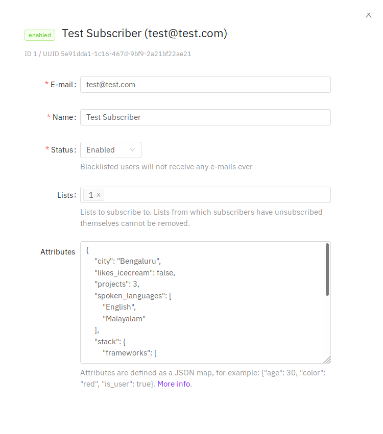
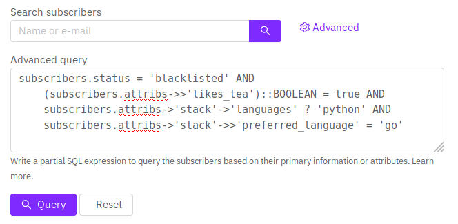

# Querying and segmenting subscribers

List Pocket supports two ways to segment subscribers:

1. **Visual filters** (recommended) — build conditions on tags, attributes, status, email/name/phone, and list membership without writing SQL.
2. **SQL expressions** — partial SQLite `WHERE` fragments for power users (requires the `subscribers:sql_query` permission).

## Visual filters

On the Subscribers page, open **Filters** and add conditions. Conditions in the main group are combined with **AND**. Use **Add OR group** when any of several conditions should match.

Supported fields:

| Field | Examples |
| ----- | -------- |
| Tag | Has any / all / none of selected tags (`attribs.tags`) |
| Attribute | Equals, contains, exists, numeric comparisons on JSON keys (including dotted paths like `stack.preferred_language`) |
| Email / name / phone | Equals, contains, starts with, ends with |
| Status | Is / is not `enabled`, `disabled`, or `blocklisted` |
| List | In / not in selected lists |

Filters are sent to the API as a structured `filters` JSON payload and compiled server-side into parameterized SQL. They do **not** require the SQL permission.

### Example `filters` payload

```json
{
  "logic": "and",
  "rules": [
    { "field": "tag", "op": "has_any", "value": ["vip"] },
    { "field": "attrib", "key": "city", "op": "eq", "value": "Bengaluru" },
    {
      "logic": "or",
      "rules": [
        { "field": "email", "op": "contains", "value": "@acme.com" },
        { "field": "attrib", "key": "company", "op": "eq", "value": "Acme" }
      ]
    }
  ]
}
```

## Database fields (SQL)

These are the fields in the subscriber database that can be queried with raw SQL.

| Field                    | Description                                                                                         |
| ------------------------ | --------------------------------------------------------------------------------------------------- |
| `subscribers.uuid`       | The randomly generated unique ID of the subscriber                                                  |
| `subscribers.email`      | E-mail ID of the subscriber                                                                         |
| `subscribers.name`       | Name of the subscriber                                                                              |
| `subscribers.status`     | Status of the subscriber (`enabled`, `disabled`, `blocklisted`)                                     |
| `subscribers.attribs`    | Map of arbitrary attributes represented as JSON (use SQLite JSON1 functions). |
| `subscribers.created`    | Timestamp when the subscriber was first added (exposed as `created_at` in the API)                  |
| `subscribers.updated`    | Timestamp when the subscriber was modified (exposed as `updated_at` in the API)                     |

## Sample attributes

Here's a sample JSON map of attributes assigned to an imaginary subscriber.

```json
{
  "city": "Bengaluru",
  "likes_tea": true,
  "spoken_languages": ["English", "Malayalam"],
  "projects": 3,
  "tags": ["vip", "demo-booked"],
  "stack": {
    "frameworks": ["echo", "go"],
    "languages": ["go", "python"],
    "preferred_language": "go"
  }
}
```



## Sample SQL query expressions

Raw SQL is available under **Filters → SQL** for users with the `subscribers:sql_query` permission.



#### Find a subscriber by e-mail

```sql
-- Exact match
subscribers.email = 'some@domain.com'

-- Partial match to find e-mails that end in @domain.com.
subscribers.email LIKE '%@domain.com'
```

#### Find a subscriber by name

```sql
-- Find all subscribers whose name start with John.
subscribers.name LIKE 'John%'
```

#### Multiple conditions

```sql
-- Find all Johns who have been blocklisted.
subscribers.name LIKE 'John%' AND subscribers.status = 'blocklisted'
```

#### Querying subscribers who viewed the campaign email

```sql
-- Find all subscribers who viewed the campaign email.
EXISTS(
  SELECT 1 FROM campaign_views
  WHERE campaign_views.subscriber_id = subscribers.id
    AND campaign_views.campaign_id = <put_id_of_campaign>
)
```

#### Querying attributes (SQLite JSON1)

```sql
-- Find subscribers in Bengaluru with more than 3 projects.
json_extract(subscribers.attribs, '$.city') = 'Bengaluru'
  AND CAST(json_extract(subscribers.attribs, '$.projects') AS REAL) > 3
```

#### Querying nested attributes

```sql
subscribers.status = 'blocklisted'
  AND json_extract(subscribers.attribs, '$.likes_tea') = 1
  AND EXISTS (
    SELECT 1
    FROM json_each(json_extract(subscribers.attribs, '$.stack.languages'))
    WHERE value = 'python'
  )
  AND json_extract(subscribers.attribs, '$.stack.preferred_language') = 'go'
```

#### Querying tags

```sql
-- Has any of these tags:
EXISTS (
  SELECT 1
  FROM json_each(COALESCE(json_extract(subscribers.attribs, '$.tags'), '[]')) jt
  WHERE lower(trim(CAST(jt.value AS TEXT))) IN ('vip', 'demo-booked')
)
```

To learn more about JSON expressions, see SQLite’s [JSON1 extension](https://www.sqlite.org/json1.html) (PocketBase uses SQLite under the hood).
